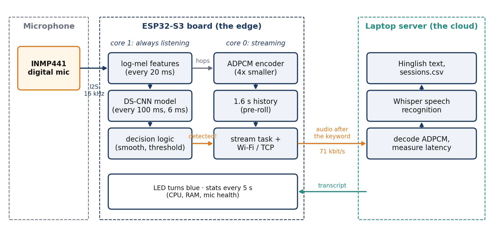
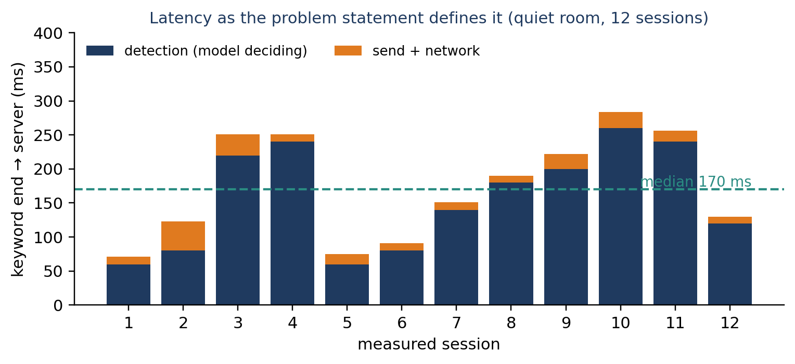

# Kunjika: a low-latency voice activator

**Keyword spotting on an ESP32-S3, streaming the command to a speech-recognition server.**
Smart India Hackathon 2026 · Problem Statement 26172 (ISRO)

A small board listens all the time for one word, *Kunjika* (Sanskrit for "key"). The moment it hears it, the board streams whatever you say next to a server, which turns it into text. Listening happens entirely on the device, using under 10% of one core and under 256 KB of RAM; the heavy speech recognition happens on the server, only after the keyword.



## Measured results

| Metric | Result | Requirement |
|---|---|---|
| Keyword end → server receiving audio | **median ~170 ms**, 90th percentile ~255 ms (12 sessions) | measured as defined |
| …of which network | median 13 ms | |
| CPU while idle listening | **9.3–9.6%** of the detection core, **6.3%** chip average | < 10% |
| RAM, complete firmware incl. Wi-Fi | **~243 KB** at peak (137.7 KB static + 105 KB heap) | < 256 KB |
| Model | **16.8 KB** int8 DS-CNN, 16.9 KB working memory, 6 ms per run | ultra-lightweight |
| Audio on the network | **71 kbit/s** (IMA-ADPCM) instead of 256 kbit/s raw | minimal overhead |
| Keyword accuracy (model v3) | 88% on normal speech from unseen speakers; 0 false activations in 18.8 min of held-out Hindi podcast | high hit rate, near-zero false activations |

Every number was measured on the real hardware. How each one was measured is explained in chapter 14 of the [project documentation](docs/Kunjika_Project_Documentation.pdf).



## How it works, in one paragraph

Core 1 of the ESP32-S3 reads the INMP441 microphone at 16 kHz and, every 20 ms, computes 40 log-mel features (bit-identical to TensorFlow). Every 100 ms an int8 DS-CNN (TensorFlow Lite Micro with ESP-NN) scores the last second. When the average of three scores crosses 0.80, core 0 streams the last second of compressed audio (the pre-roll), then the live audio, over an always-open TCP connection. The server synchronizes its clock with the board to measure latency to within about ±3 ms, transcribes only the command with Whisper, returns English as English and Hindi as Hinglish, and logs every session to `sessions.csv`.

## Repository layout

| Folder | Contents |
|---|---|
| [`firmware/`](firmware/) | ESP-IDF project for the ESP32-S3: detection, streaming, networking |
| [`server/`](server/) | Python server: receives audio, measures latency, transcribes with Whisper |
| [`training/`](training/) | data preparation, synthetic voices (Piper TTS), model training (Colab) |
| [`models/`](models/) | the trained Kunjika v3 model and its feature settings |
| [`tools/mic_recorder/`](tools/mic_recorder/) | ESP-IDF tool that records the INMP441 to WAV files over USB |
| [`docs/`](docs/) | full project documentation (38 pages) and the dataset recording protocol |

## Quick start

You need an ESP32-S3 board, an INMP441 microphone ([wiring](firmware/README.md#wiring)), ESP-IDF 6.1, and Python 3.9+ on a laptop connected to the same **2.4 GHz** Wi-Fi network.

**1. Start the server on the laptop**

```bash
cd server
pip install -r requirements.txt
python kws_server.py
```

**2. Configure, build and flash the board**

```bash
cd firmware
cp main/net_config.example.h main/net_config.h     # then edit: Wi-Fi name, password, laptop IP
idf.py set-target esp32s3
idf.py build
idf.py -p COM6 flash monitor
```

**3. Say "Kunjika", then a command.** The LED turns blue, the server prints the latency the instant the audio arrives, and the transcript follows a few seconds later.

No hardware at hand? `python server/fake_board.py` speaks the board's exact protocol, so you can test the server on its own.

## Documentation

- **[Project documentation (PDF)](docs/Kunjika_Project_Documentation.pdf)**: how every part works, why each decision was made, all measurements, the bugs we hit, and a glossary of about 80 terms. Start here.
- [Dataset recording protocol (PDF)](docs/Kunjika_Dataset_Collection_Protocol.pdf): how the keyword recordings were collected.

## Data and privacy

The recordings used for training (team members' voices, conversations, and the podcast) are **not** included in this repository: they contain real people's voices. The training scripts document the expected folder layout, so the pipeline can be rerun on any new recordings.

## Built entirely on open source

| Component | Used for | Licence |
|---|---|---|
| [ESP-IDF](https://github.com/espressif/esp-idf) (FreeRTOS, lwIP) | firmware framework, Wi-Fi, TCP/IP | Apache-2.0 |
| [esp-tflite-micro](https://github.com/espressif/esp-tflite-micro) / [ESP-NN](https://github.com/espressif/esp-nn) | running the model on the ESP32-S3 | Apache-2.0 |
| [esp-dsp](https://github.com/espressif/esp-dsp) | FFT for the features | Apache-2.0 |
| [TensorFlow](https://github.com/tensorflow/tensorflow) + Model Optimization | training and int8 quantization | Apache-2.0 |
| [faster-whisper](https://github.com/SYSTRAN/faster-whisper) / [Whisper](https://github.com/openai/whisper) | speech recognition on the server | MIT |
| [Piper](https://github.com/OHF-Voice/piper1-gpl) | synthetic training voices (a separate tool; not included here) | GPL-3.0 |
| [Speech Commands v0.02](https://arxiv.org/abs/1804.03209) | general negative examples | CC BY 4.0 |

## Licence

Apache License 2.0; see [LICENSE](LICENSE).
